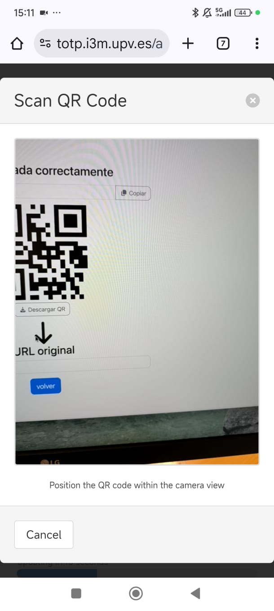
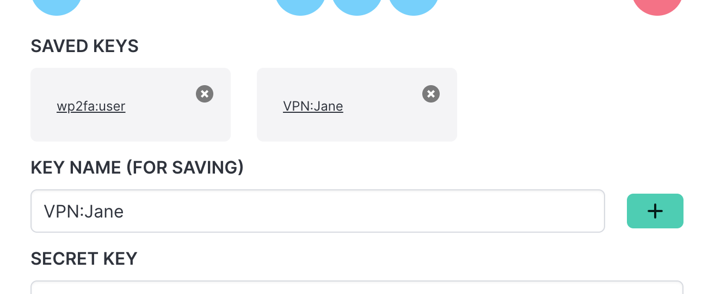
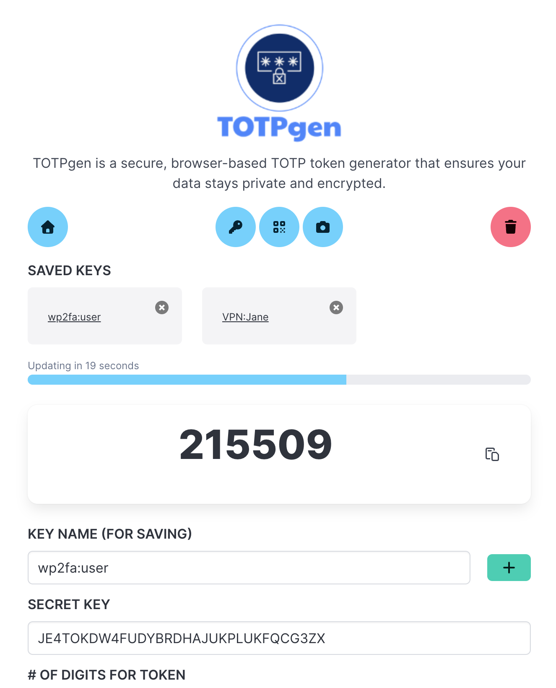
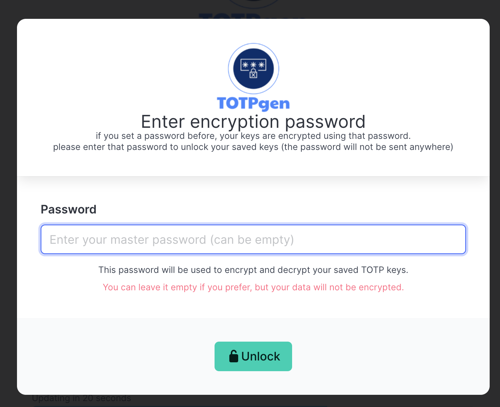

# TOTPgen - Secure Browser-Based TOTP Token Generator


[](https://www.gnu.org/licenses/gpl-3.0)
[](https://opensource.org/)

A modern, secure, and privacy-focused TOTP (Time-based One-Time Password) generator that runs entirely in your web browser. No installation required, no data collection, and complete client-side encryption.

If you just want to have a TOTP-generator web app, check [my TOTPgen app](https://totp.i3m.upv.es), and feel free to install it as a Progressive Web App (PWA) on your device. It is free!

[](https://totp.i3m.upv.es)

## Table of Contents

- [Why TOTPgen?](#why-totpgen)
- [Features](#features)
- [How It Works](#how-it-works)
- [Security](#security)
- [Usage](#usage)
- [Open Source & Auditable](#open-source--auditable)
- [Attributions](#attributions)
- [License](#license)
- [Contributing](#contributing)

## Why TOTPgen?

Traditional authenticator apps like Google Authenticator and Microsoft Authenticator are excellent, but they have limitations:

- **Mobile-only**: Not ideal for desktop workflows
- **Installation required**: Needs device setup and permissions
- **Sync concerns**: Cloud sync raises privacy questions
- **Device dependency**: Lose your phone, lose access

**TOTPgen** provides a modern, web-based alternative that:

- ✅ Works on **any device** with a modern web browser (desktop, laptop, tablet, mobile)
- ✅ Requires **no installation** - just open and use (or optionally install as a PWA)
- ✅ Keeps your data **completely private** with client-side encryption
- ✅ Is **100% open source** and auditable for security
- ✅ Stores everything **locally** in your browser - no cloud, no servers, no tracking
- ✅ Can be **installed as an app** on your device while maintaining complete privacy

## Features

### 🌐 Works Everywhere
Use TOTPgen on any device with a modern web browser. Desktop, laptop, tablet, or mobile - it works seamlessly everywhere without any installation.

### 🔒 Complete Privacy
Your data never leaves your browser. All encryption and decryption happens locally using the Web Crypto API. We can't access your keys because we never see them.

### 🔐 Encrypted Storage
All your TOTP keys are encrypted with **AES-256-GCM** using a master password only you know. Your keys are not stored in plain text, even in your browser's local storage.

### 📱 QR Code Import
Import TOTP keys easily by:
- **Scanning QR codes** with your device camera
- **Uploading QR code images** from your computer
- **Manual entry** of secret keys

No need to manually type long secret keys - just scan and go!



### � Export & Import Keys
**Use the same configuration across multiple devices!** TOTPgen allows you to export and import your entire key collection:

- **Encrypted Export**: Export all your keys to a secure, encrypted JSON file
- **Password Protection**: Protect your export with a separate password (independent from your master password)
- **Cross-Device Sync**: Transfer your keys between devices securely
- **Backup & Recovery**: Create encrypted backups of your authentication keys
- **Optional Encryption**: Choose to export without encryption for convenience (with clear warnings)

The export file includes version information, export date, and key count for easy management. When importing, you have full control over duplicate keys - choose to overwrite, rename, or skip each conflicting key individually.

**Perfect for**: Setting up TOTPgen on a new device, creating encrypted backups, or maintaining the same keys across your desktop and mobile devices while keeping everything secure and private.

### �💾 Save Multiple Keys
Store and manage multiple TOTP keys for different services. Each key can have a custom name for easy identification.



### 🔄 Automatic Token Generation
TOTP tokens are generated automatically and refresh every 30 seconds (or according to your configuration). The countdown timer shows you exactly when the next token will be generated.



### 🔧 Customizable
Support for custom configurations:
- **Digits**: 6, 7, or 8 digit tokens
- **Period**: Custom refresh intervals (default 30 seconds)
- **Algorithm**: SHA1, SHA256, SHA512

### 📲 Progressive Web App (PWA)
TOTPgen is built as a **Progressive Web App**, which means:
- **Install on your device**: Add TOTPgen to your home screen or desktop just like a native app
- **Offline access**: Once loaded, the app works without an internet connection
- **Native app experience**: Full-screen mode, app icon, and smooth performance
- **Still completely private**: Installing the app does NOT change the privacy model - your data remains local and encrypted
- **No app store required**: Install directly from your browser without going through any app store

The PWA architecture ensures that even when installed, TOTPgen continues to operate entirely client-side with zero data transmission to any server.

## How It Works

### 1. Set Your Master Password
Create a master password to encrypt your TOTP keys. This password:
- **Never leaves your device**
- **Is never stored anywhere**
- **Is used only for local encryption/decryption**

You can also choose to leave it empty for convenience, though encryption is strongly recommended for security.




### 2. Import Your Keys
Add your TOTP keys using any of these methods:
- Scan QR codes with your camera
- Upload QR code images
- Enter secret keys manually

All keys are automatically encrypted with your master password and saved in your browser's local storage.

### 3. Generate Tokens
Your TOTP tokens are generated automatically and refresh according to the configured period (typically every 30 seconds). Copy them with one click and use them for two-factor authentication on any service.

## Security

TOTPgen takes security seriously. Here's how your data is protected:

### 🔐 Client-Side Encryption
- **AES-256-GCM**: Industry-standard encryption algorithm
- **PBKDF2 Key Derivation**: 100,000 iterations for strong key derivation from your password
- **Web Crypto API**: Native browser cryptography for security and performance
- **Zero-Knowledge Architecture**: Your master password and keys never leave your device

### 🔒 No Data Collection
- **No tracking**: We don't track your usage
- **No cookies**: No unnecessary cookies
- **No analytics**: Your privacy is respected
- **No backend**: Everything runs in your browser

### ✅ Auditable Code
This project is open source under **GPL v3**, which means:
- The entire codebase is publicly available for review
- Security experts can audit the code
- You can verify there are no backdoors or malicious code
- The community can contribute security improvements

### 🛡️ Local Storage Only
Your encrypted keys are stored only in your browser's local storage:
- **Not synced to the cloud**
- **Not sent to any server**
- **Stays on your device**
- **You control your data**

## Usage

### Basic Usage

1. **Open TOTPgen** in your web browser
2. **Set a master password** (or leave empty)
3. **Add your first TOTP key**:
   - Click the QR code button and scan a QR code, or
   - Click the camera button to use your device camera, or
   - Enter the secret key manually
4. **Save the key** with a name (e.g., "Gmail", "GitHub", "AWS")
5. **Copy the token** when you need it for 2FA

### Changing Your Master Password

1. Click the **key icon** (🔑) in the toolbar
2. Enter your **current password**
3. Enter your **new password**
4. All your keys will be re-encrypted with the new password


### Managing Keys

- **Load a saved key**: Click on its name in the saved keys list
- **Delete a key**: Click the ❌ button next to the key name
- **Clear all data**: Click the trash icon (⚠️ Warning: This cannot be undone!)

### Exporting and Importing Keys

TOTPgen makes it easy to transfer your keys between devices or create secure backups:

#### Exporting Keys

1. Click the **export icon** (📤) in the toolbar
2. Enter a password to encrypt the export file (recommended)
   - You can leave it empty for an unencrypted export (not recommended)
   - This password is independent from your master password
3. Confirm the password
4. Click **Export** to download the JSON file
5. The file will be named `totpgen-export-[timestamp].json`

**Security Note**: The exported file contains:
- Version information and export date
- Number of keys included
- Your keys encrypted with AES-256-GCM (if password provided)
- All key configurations (digits, period, algorithm)

#### Importing Keys

1. Click the **import icon** (📥) in the toolbar
2. Select your previously exported JSON file
3. If the file is encrypted, enter the export password
4. Review and resolve any duplicate key names:
   - **Overwrite**: Replace the existing key with the imported one
   - **Rename**: Keep both keys with an automatically generated unique name
   - **Skip**: Don't import this particular key
5. All imported keys are automatically encrypted with your current master password

**Cross-Device Usage**: Export your keys from one device and import them on another to maintain the same TOTP configuration across all your devices. The encryption ensures your keys remain secure during transfer.

### Installing as a Progressive Web App (PWA)

TOTPgen can be installed on your device for a native app-like experience while maintaining complete privacy:

#### On Desktop (Chrome, Edge, Brave)
1. Open TOTPgen in your browser
2. Look for the **install icon** (⊕) in the address bar, or
3. Click the browser menu (⋮) and select **"Install TOTPgen..."**
4. Confirm the installation
5. TOTPgen will now appear as a standalone app in your applications folder

#### On Mobile (iOS Safari)
1. Open TOTPgen in Safari
2. Tap the **Share button** (□↑)
3. Scroll down and tap **"Add to Home Screen"**
4. Name the app and tap **"Add"**
5. TOTPgen will appear on your home screen like a native app

#### On Mobile (Android Chrome)
1. Open TOTPgen in Chrome
2. Tap the browser menu (⋮)
3. Select **"Add to Home screen"** or **"Install app"**
4. Confirm the installation
5. TOTPgen will appear in your app drawer

**Important Privacy Note**: Installing TOTPgen as a PWA does **NOT** change how your data is handled:
- ✅ All data remains **local** to your device
- ✅ Your keys stay **encrypted** with your master password
- ✅ **No data is synced** to any cloud or server
- ✅ The app works **completely offline** after installation
- ✅ Your privacy is **fully maintained** - nothing is ever transmitted

The PWA installation simply provides convenience and a better user experience without compromising security or privacy.

## Open Source & Auditable

TOTPgen is **100% open source** and licensed under **GNU General Public License v3.0 (GPL-3.0)**.

### Why GPL v3?

The GPL v3 license ensures that:

1. **Freedom to Use**: Anyone can use this software for any purpose
2. **Freedom to Study**: The source code is available for inspection and learning
3. **Freedom to Modify**: You can modify the code to suit your needs
4. **Freedom to Distribute**: You can share the software with others
5. **Copyleft Protection**: Derivative works must also be open source under GPL v3

### Security Through Transparency

Open source is crucial for security software because:

- 🔍 **Auditable**: Security experts can review the code for vulnerabilities
- 🛡️ **Trustworthy**: No hidden backdoors or malicious code
- 🤝 **Community-Driven**: Multiple eyes catch more bugs
- 📈 **Continuous Improvement**: Anyone can contribute security enhancements
- ✅ **Verifiable**: You can inspect exactly what the code does

**We encourage security researchers and developers to audit this code.** If you find any security issues, please report them responsibly through [GitHub Issues](https://github.com/dealfonso/totp-generator/issues).

### Self-Hosting

Because TOTPgen is open source and runs entirely client-side, you can:

1. **Clone the repository**:
   ```bash
   git clone https://github.com/dealfonso/totp-generator.git
   ```

2. **Host it yourself** on any web server or locally

3. **Review the code** before trusting it with your TOTP keys

4. **Modify it** to add your own features

## Attributions

### Original Work

TOTPgen is inspired on the excellent work by **[Dan Hersam](https://dan.hersam.com)**, who created [TOTP Generator](https://totp.danhersam.com/).

Thank you, Dan, for creating inspiring me to make this project possible!

### Core Dependencies

This project would not be possible without these excellent open-source libraries:

- **[OTPAuth](https://github.com/hectorm/otpauth)** by Héctor Molinero Fernández
  - License: MIT
  - Used for: TOTP token generation

- **[jsQR](https://github.com/cozmo/jsqr)** by Cozmo
  - License: Apache 2.0
  - Used for: QR code scanning and decoding

- **[Vue.js](https://github.com/vuejs/core)** by Evan You and the Vue team
  - License: MIT
  - Used for: Reactive UI framework

- **[Clipboard.js](https://github.com/zenorocha/clipboard.js)** by Zeno Rocha
  - License: MIT
  - Used for: Copy to clipboard functionality

#### UI & Styling

- **[Bulma](https://github.com/jgthms/bulma)** by Jeremy Thomas
  - License: MIT
  - Used for: CSS framework and responsive design

- **[Font Awesome](https://github.com/FortAwesome/Font-Awesome)**
  - License: Font Awesome Free License
  - Used for: Icons

#### Resources & Inspiration

Additional resources that helped in the development:

- [TOTP: Time-based One-Time Password Algorithm (RFC 6238)](https://tools.ietf.org/html/rfc6238)
- [Extracting TOTP secrets from Authy](https://www.pommepause.com/2014/10/how-to-extract-your-totp-secrets-from-authy/)
- [Web Crypto API Documentation](https://developer.mozilla.org/en-US/docs/Web/API/Web_Crypto_API)

#### Acknowledgments

Special thanks to:

- **Dan Hersam** for the original TOTP web generator
- The **OTPAuth** developers for a solid TOTP library
- The **open source community** for all the amazing tools
- Everyone who contributed ideas and feedback

## License

This project is licensed under the **GNU General Public License v3.0 (GPL-3.0)**.

See the [LICENSE](LICENSE) file for the full license text.

## Contributing

Contributions are welcome! Here's how you can help:

### Reporting Issues

- 🐛 **Bug reports**: [Open an issue](https://github.com/dealfonso/totp-generator/issues)
- 🔒 **Security vulnerabilities**: Please report responsibly via GitHub Issues
- 💡 **Feature requests**: Share your ideas in the Issues section

### Contributing Code

1. **Fork** the repository
2. **Create** a feature branch (`git checkout -b feature/amazing-feature`)
3. **Commit** your changes (`git commit -m 'Add amazing feature'`)
4. **Push** to the branch (`git push origin feature/amazing-feature`)
5. **Open** a Pull Request

### Development Guidelines

- Write clean, commented code
- Test your changes thoroughly
- Ensure security best practices
- Update documentation as needed
- Follow the existing code style

### Code of Conduct

Be respectful, inclusive, and constructive in all interactions.

## Support

- 📖 **Documentation**: You're reading it!
- 🐛 **Issues**: [GitHub Issues](https://github.com/dealfonso/totp-generator/issues)
- 💬 **Discussions**: [GitHub Discussions](https://github.com/dealfonso/totp-generator/discussions)
- 📧 **Contact**: [Carlos A. on GitHub](https://github.com/dealfonso)

## Roadmap

Future enhancements being considered:

- [ ] Export/import functionality for backups
- [ ] Biometric authentication support
- [ ] Dark mode theme
- [ ] Multi-language support (i18n)
- [ ] Browser extension version
- [ ] Backup codes generation

---

<div align="center">

**Made with ❤️ by [Carlos A.](https://github.com/dealfonso)**

⭐ **Star this repo** if you find it useful!

[🚀 Launch TOTPgen](#) | [📖 Documentation](#) | [🐛 Report Issues](https://github.com/dealfonso/totp-generator/issues)

</div>
